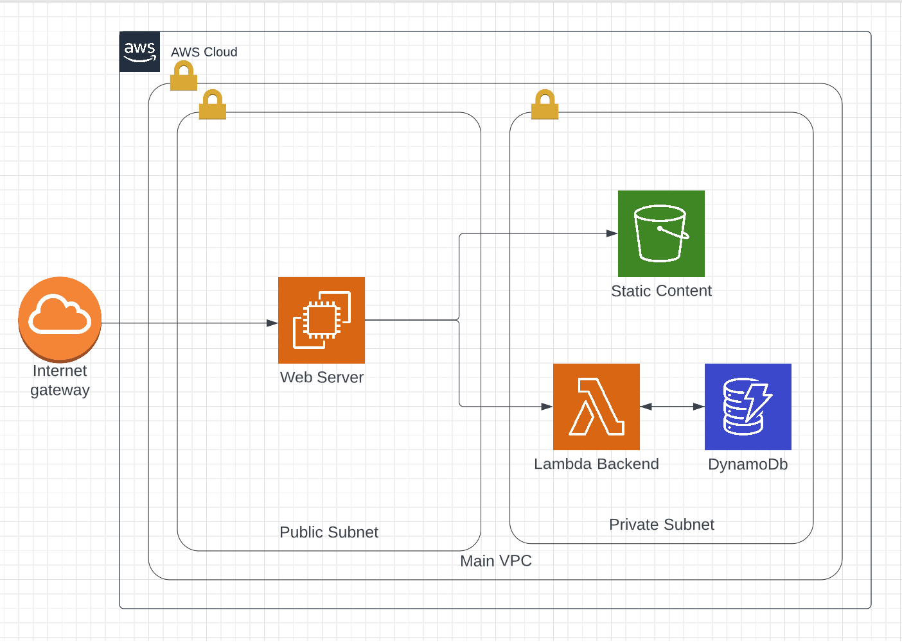

# Photographers Paradise
## Web app one stop shop for wedding/engagement photographers
Photographers often must deal with multiple platforms: one for scheduling, contacting, and invoicing (often honeybook), and one for photo delivery and portfolio display. Our goal is to create a Webapp that combines both into one website to ease photographers pain point of having to deal with multiple platforms and subscriptions. In the future we would also aim to introduce new features. 

## Team Needs:
So far 1 full-stack developer has committed to the team. We are looking for one designer who could assist with graphics, and a Figma prototype. We are also looking for another developer who could assist with front end development but primarily work on the backend, primarily working with the following:
- Aws Lambda (language of your choice)
- Aws DynamoDb
- Aws S3

Designers can expect to be desiging multiple pages, including but not limited to:
- Booking page for clients
- A calendar page for photographers to view clients appointments
- A portfolio page for photographers to host their pictures
- A general dashboard for photographers to manage their account from.

## Architecture

We are planning on building our solution on AWS. Ideally, we would deploy via Terraform through CI/CD GitHub actions, but if we don’t get there, we will just use the console. Knowledge of AWS would be extremely valuable for our team. 

## Developer Instructions
If you would like to join the team, please message me on slack (Caleb Siebach), or approach me after all the presentations are over! 

## Contributor Instructions
Contributors will merge through branching and pull requests. If you have a new feature, create a new branch. After testing, submit a pull request and review the code with the other developer. After a review, merge the branch in. 

## Known Issues / Future Improvements
None yet 😊
     
## Sponsor poor college students? 
- [Caleb Siebach](https://venmo.com/code?user_id=2946059366039552553&created=1665890984)
- [Shad Baird](https://google.com)
- [Developer (You)] (https://google.com)
- [Designer (You)] (https://google.com)

## Acknowledge 
Too many YouTube tutorials to count, along with a great many patient professors, and Divine Providence.
